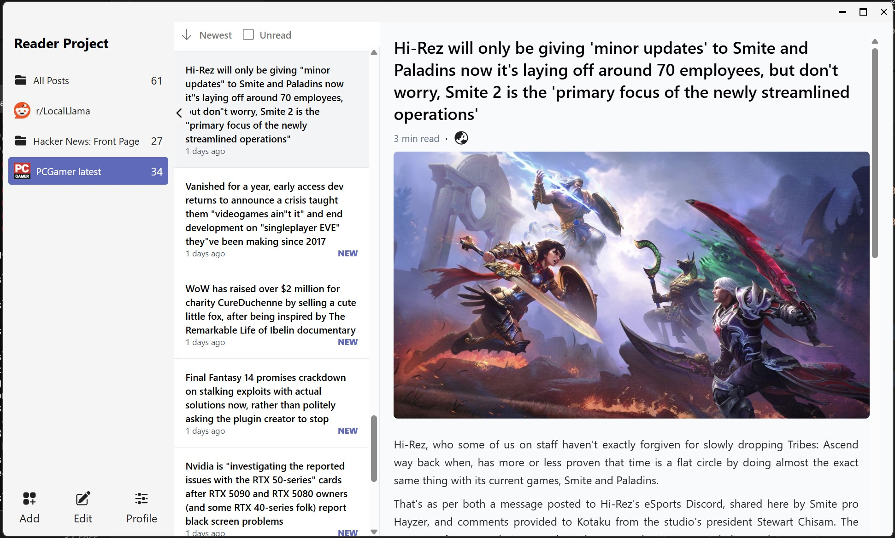

# reader-project

   

**reader-project** is a privacy-focused RSS aggregator built with Tauri, SvelteKit and Tailwind.

> This project is currently **under active development**. Features may change, and some parts may be incomplete. Feedback and contributions are welcome!

## ✨ Features

- 📌 Add & Manage Feeds - Easily add custom RSS feeds.
- 📌 Read/Unread Tracking - Keep track of read articles.
- 📁 Offline Storage - Persist articles in an SQLite database.
- 🎨 Modern UI - Built with Tailwind CSS for a smooth experience.
- 📰 Content Extraction - Load and display article contents efficiently.
- 💾 Import & Export Feeds from OPML (XML).

## 🛠️ Tech Stack
- Frontend: SvelteKit + Tailwind CSS
- Backend: Tauri (Rust)
- Database: SQLite

## 🤝 Contributing
Contributions are welcome! Feel free to open issues or submit pull requests.

## 📜 License
This project is licensed under the MIT License.

---

Made with ❤️ using [Tauri](https://tauri.app/), [SvelteKit](https://svelte.dev/) and [TailwindCSS](https://tailwindcss.com/)