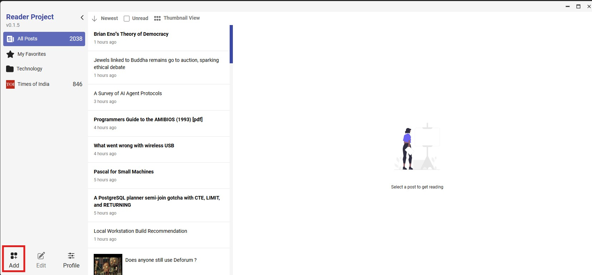
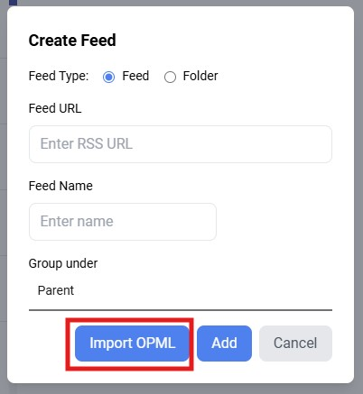
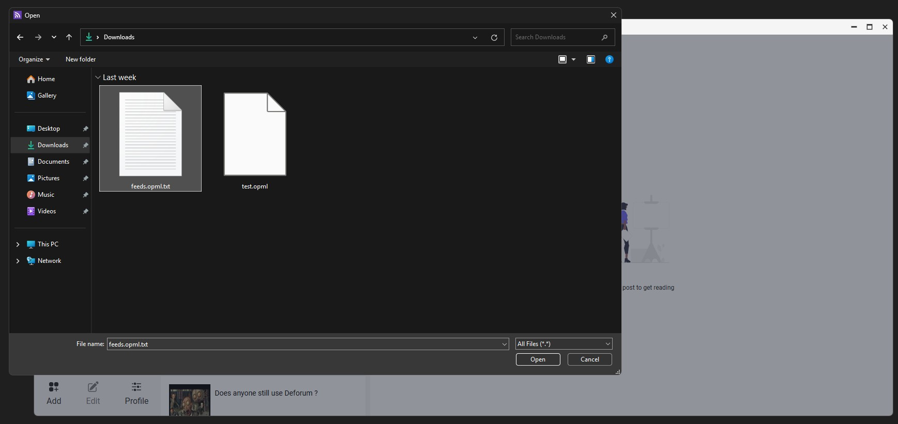
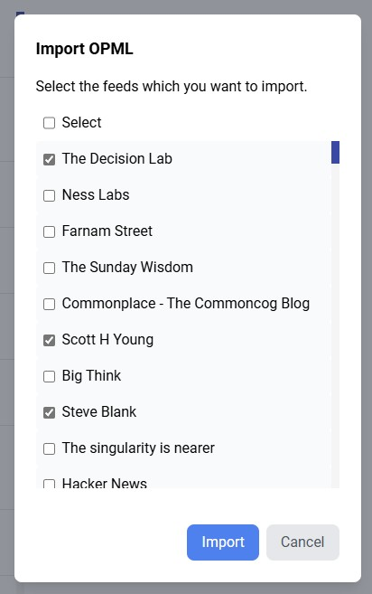
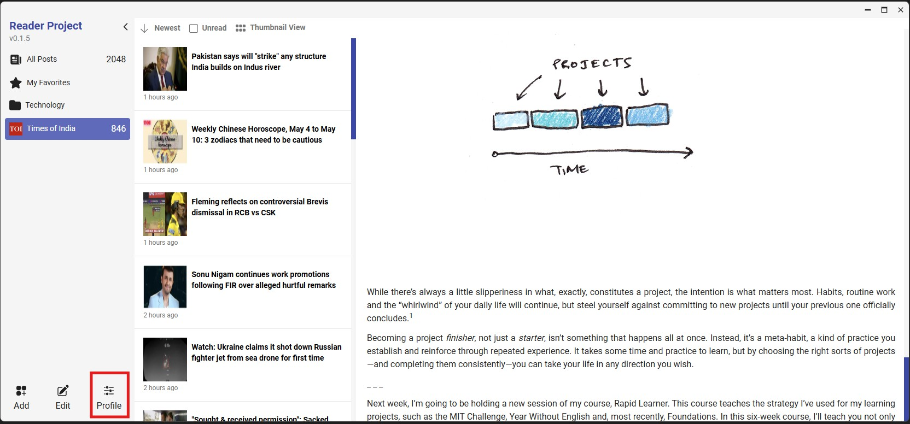
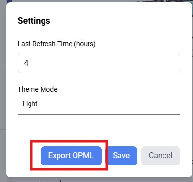
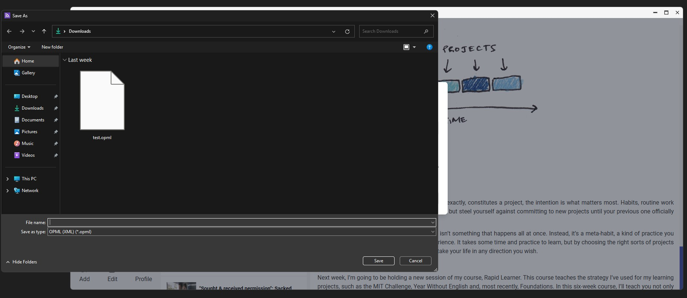

# 📥 Importing OPML

You can directly import feeds from an OPML file:

1. Select the **Add** option to add new feeds.

   

2. In the add window, select **Import OPML**.

   

3. This will launch a file browser where you need to select the OPML file.

   

4. Once you select a valid OPML file, its contents will be parsed and shown in a dialog box where you can choose which feeds to import.

   

> **Note:** When reading an OPML file, the structure is flattened and the content is read directly. If you want to reorganize the folders, you currently need to update them manually.

# 📤 Exporting OPML

1. Select **Settings** to open the Settings window.

   

2. In the Settings window, select **Export OPML**.

   

3. This will open a file dialog where you can specify the path and export the OPML (XML) file.

   
